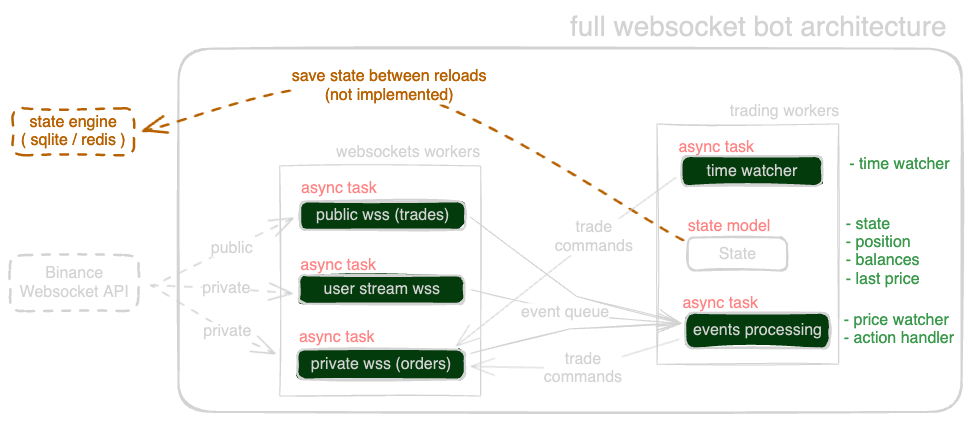

# Тестовый торговый бот для Binance TestNet

Этот тестовый бот подключается к Binance TestNet, и использует `Websockets` для всех взаимодействий с биржей.
Это намеренная версия без использования REST в качестве эксперимента. Несмотря на то что для стабильности и продакшн
реди-окружений я бы рекоммендовал использовать связку `rest`+`wss`.

P.S. Бот не рассчитан на работу более 24 часов, изза особенностей реализации userDataStream.

## Принцип работы:

- подключаемся к бирже, проводим базовую инициализацию (балансы)
- покупаем заданный объем (env `POSITION_QUANTITY`) на заданном рынке (env `SYMBOL`)
- следим за изменениями цены и при достижении заданных уровней (стоп-лосс, тейк-профит,
  env `POSITION_SL_PERCENT`/`POSITION_TP_PERCENT`)
  закрывает позицию.
- Если ценовые уровни не достигнуты, позиция закрывается по истечении времени (env `POSITION_HOLD_TIME`).
- После закрытия позиции бот спит заданное время (задается через env `POSITION_SLEEP_TIME`) и затем покупает новую
  позицию.

### Полный список переменных окружения:

| env                 | description                                 | default           | Required |
|---------------------|---------------------------------------------|-------------------|----------|
| API_KEY             | binance api key                             | None              | True     |
| PRIVATE_KEY_BASE64  | base64 encoded private key                  | None              | True     | 
| SYMBOL              | symbol for trading                          | BTCUSDT           | False    |
| POSITION_QUANTITY   | quantity for position                       | 0.001             | False    |
| POSITION_SL_PERCENT | stop loss (percent)                         | 0.25              | False    |
| POSITION_TP_PERCENT | take profit (percent)                       | 0.25              | False    |
| POSITION_HOLD_TIME  | position hold time (seconds)                | 60                | False    |
| POSITION_SLEEP_TIME | sleep time after exit (seconds)             | 30                | False    |
| LOGLEVEL            | log level, max available DEBUG              | INFO              | False    |
| JSON_LOGS           | json log formatter for log systems like elk | False             | False    |
| ENVIRONMENT         | environment name                            | development       | False    |
| SAVE_LOG_FILE       | save logs to file (bool)                    | False             | False    |
| LOG_FILE_PATH       | path to log file                            | /app/logs/bot.log | False    |

## Примерная архитектура бота



## Подготовка и запуск

### Подготовка API ключей

В проекте бота используется авторизация через `Ed25519` для подписи запросов к бирже. Для работы
бота вам
необходимо создать приватный и публичные ключи, затем загрузить публичный ключ на биржу и получить `apiKey`
связанный с вашим ключом. После этого приватный ключ нужно закодировать в base64 и передать в переменную окружения.

- процесс создания и загрузки ключей на
  binance [хорошо описан в это мануале от binance](https://www.binance.com/en/support/faq/how-to-generate-an-ed25519-key-pair-to-send-api-requests-on-binance-6b9a63f1e3384cf48a2eedb82767a69a).
- Загрузить ключи нужно будет [в TestNet](https://testnet.binance.vision/), предварительно произведя вход через github.
- После загрузки ключа на binance testnet вам выдадут ApiKey который вам нужно будет сохранить для работы бота.
- Получить BASE64 приватного ключа можно через команду `base64 -i private_key.pem` и сохранить его в переменную
  окружения `PRIVATE_KEY_BASE64`.

```shell
export PRIVATE_KEY_BASE64=$(base64 -i privatekey.pem)
```

### Запуск на amazon EC2 (amazon linux)

Для запуска на AWS EC2, лучше всего использовать Amazon Linux 2 AMI. Я рекомендую использовать docker, для этого
есть подготовленный Dockerfile и это описание для сборки и запуска контейнера.

1. Создайте новый EC2 инстанс на Amazon Linux 2 AMI (t2.nano будет достаточно), я рекомендую использовать AWS регион
   Tokyo, тк сама биржа Binance находится в этом регионе и это обеспечит низкие задержки до 5мс. при создании
   инстанса ec2 для автоматической установки и настройки docker при запуске удобно задать ему скрипт `user data` (см.
   ниже)
    ```shell
    #!/bin/bash
    sudo yum update -y
    sudo yum install docker -q -y
    sudo usermod -a -G docker ec2-user
    sudo systemctl enable docker.service
    sudo systemctl start docker.service
    ```
2. Подключитесь к инстансу по ssh
   ```shell
    ssh -i "your-key.pem" ec2-user@<ec2 ip address>
   ```
3. Подготовьте переменные окружения для запуска бота:
    ```shell
    export API_KEY=<your-binance-api-key>
    export PRIVATE_KEY_BASE64=<your-binance-private-key-base64>
    ```

### Сборка и запуск в Docker контейнере

сборка контейнера:

```shell
docker buildx build -t test_bot_binance -f deployment/Dockerfile .
```

запуск контейнера:

```shell
docker run --rm -it -e API_KEY=$API_KEY -e PRIVATE_KEY_BASE64=$PRIVATE_KEY_BASE64 --name test_bot test_bot_binance
```

### Запуск без докера

Если вы решите запустить бота без докера, вам нужно установить `python 3.12`, `python-pip` (или `uv`) и установить
зависимости проекта:

```shell
pip install -r requirements.txt
```

или

```shell
uv pip install -r requirements.txt
```

## Логирование

В проекте используется `structlog`. Стандартный вывод логов доступен при уровне `INFO`, в логах вы можете
встретить поле `latency` в котором высчитывается разницу между локальным (при получении) и биржевым (при
отправке) временем события (если оно доступно). Также для всех логов передаются: `version`, `environment` которые
задаются в `settings.py` или через переменные окружения.

По умолчанию все логи пишутся в `stdout`, если вам нужно настроить сохранение логов в файл (что не рекомендуется
делать внутри контейнера) ниже будет инструкция как это сделать.

### LOGLEVEL

При включении `LOGLEVEL` = `DEBUG` в логах появятся подробности:

- все полученные и отправленные сообщения в публичном/приватном каналах для wss сообщений
- другие подробности по мере обогащения данных

### Сохранение логов в файл

При включении env `SAVE_LOG_FILE` логи будут сохраняться в файл, путь к файлу можно задать через `LOG_FILE_PATH`.
Если используете в контейнере не забывайте пробросить путь к файлу через volume.

## Подготовка окружения для разработки и тестов:

В проекте используется python 3.12 и uv для компилирования зависимостей. Для запуска тестов и линтеров вам понадобится:

1. Установить python 3.12 (если еще не установлен). Я рекомендую использовать `pyenv`.
2. Установить make (если не установлен) `brew install make` для MacOS.
3. Выполнить `make requirements-dev` для установки всех (в т.ч. тестовых) зависимостей проекта.
4. Для запуска тестов запустить `make test`.
5. Для разработки используются pre-commit-hooks которые устанавливаются командой `make pre-commit`.
5. Подготовить ключи и переменные окружения для запуска бота (см. выше).

## TODO (что можно доделать/переделать):

- [ ] Сделать логирование PnL при закрытии позиции (с учетом комиссии)
- [ ] Сделать обработку балансов и минимальных объемов (ордеров) для выбранной пары
- [ ] Заменить человекопонятный id на uuid, сделать процессинг сообщений / ордеров
- [ ] Сделать сохранение стейта в sqlite/redis (для сохранения стейта при перезапуске)
- [ ] Переделать работу с userDataStream и обновленим listen_key (и пересозданием при необходимости через 24часа)
- [ ] Docker-compose для быстрой сборки/запуска и шаблон .env файла
